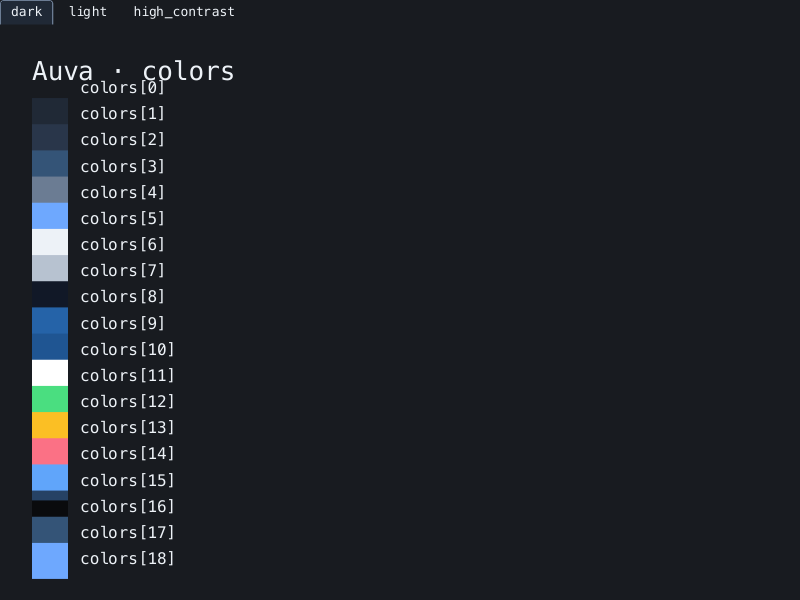

Auva turns a JSONC design-token file into a Zaniah theme. Use it to inspect
colors in a desktop window, check text contrast, and export PNG theme sheets.



## Install

You need Ruby 3.2 or newer:

```sh
ruby --version
gem install auva
```

The desktop preview uses Zaniah's native backend for macOS, Linux, or Windows.
It needs a working desktop session; see Zaniah's
[native-backend requirements](https://noxdea.github.io/zaniah/docs/guides/native.html).
Contrast checks and PNG export can run without a desktop window.

## Create your first token file

Save this as `tokens.jsonc`:

```jsonc
{
  // Keep the light theme's defaults, then change the accent.
  "extends": "light",
  "colors": {
    "accent": "#245b9b"
  },
  "motion": {
    "reduced": true
  }
}
```

Comments and trailing commas are accepted. Unspecified tokens keep their
values from the base theme, so you can start with a small file.

## Open and check the theme

Run this in a terminal attached to your desktop:

```sh
auva tokens.jsonc
```

The window shows color swatches. Edit the file in your usual editor and save
it to reload the preview. Auva previews the file; it does not edit it.

Close the window, then check the six built-in text/background pairs:

```sh
auva tokens.jsonc --check --strict
```

Each line contains a contrast ratio and `AA`, `AAA`, or `FAIL`. The command
returns a nonzero exit status if a pair fails AA or the token file is invalid.
See [Contrast checks](contrast.md) for the thresholds and checks covered.

To save all eight preview sheets:

```sh
auva tokens.jsonc --export theme-sheets
```

Open `theme-sheets/colors.png` or another sheet in your image viewer.
[Preview and export](preview.md) explains the categories and theme tabs.

## If something goes wrong

| Symptom | What to check |
| --- | --- |
| `token file not found` | Use the file's correct path. Quote paths that contain spaces. |
| `unknown token` or `invalid value` | Read the reported line and token path, then compare with [Design tokens](tokens.md). |
| `preview unavailable` | Check the native-backend requirements. Use `--check` or `--export` to continue without a window. |
| Only `loaded 1 theme(s)` appears | Run from an interactive terminal. Redirected output does not open a window. |
| The preview keeps its previous colors | Check the saved file with `auva tokens.jsonc --check`; an invalid update keeps the last valid theme. |

Continue with [Design tokens](tokens.md) to customize typography, spacing,
shadows, and syntax colors.
